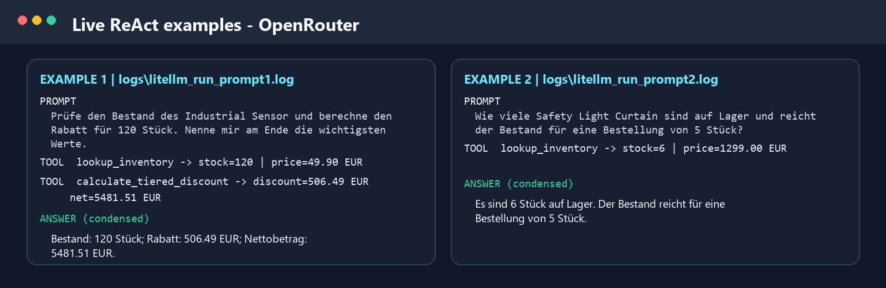
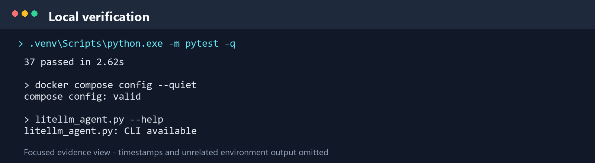
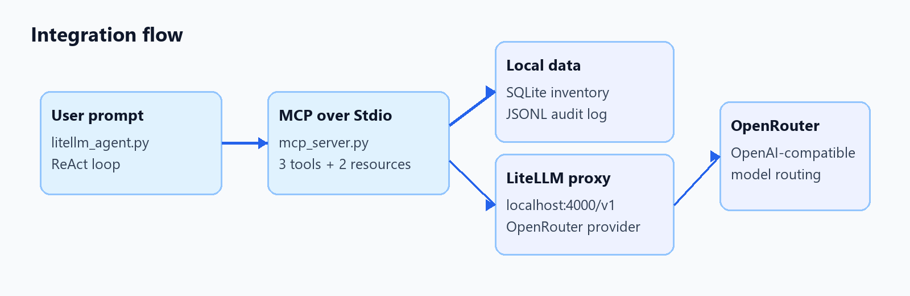

# Homework 1 - Submission Summary

Repository: [github.com/Sudashiii/dibse_industrial_computing](https://github.com/Sudashiii/dibse_industrial_computing)

## Inhalt

- SQLite-Tool `lookup_inventory` mit automatischer Erstellung und Befüllung der Produktdatenbank.
- Formula Engine `calculate_tiered_discount` mit gestaffelten Mengenrabatten.
- JSONL-Audit-Tool `append_audit_event` und Resource `audit://events`.
- MCP-Stdio-Server und begrenzter ReAct-Agent über LiteLLM und OpenRouter.

OpenRouter ist hinter dem lokalen LiteLLM-Proxy geschaltet, weil dafür bereits ein Account vorhanden war.
Die beiden unten gezeigten Live-Beispiele wurden gegen den OpenAI-kompatiblen
OpenRouter-Endpunkt ausgeführt; die Repo-Konfiguration dokumentiert den
vorgesehenen lokalen LiteLLM-Proxy davor.

Beispiel-Prompt:

```powershell
uv run python litellm_agent.py "Prüfe den Bestand des Industrial Sensor und berechne den Rabatt für 120 Stück. Nenne mir am Ende die wichtigsten Werte."
```

## Live-Agent-Beispiele

Die folgenden Prompts wurden mit dem ReAct-Agent ausgeführt und als Logs
mitgespeichert:

1. Prompt: `Prüfe den Bestand des Industrial Sensor und berechne den Rabatt für 120 Stück. Nenne mir am Ende die wichtigsten Werte.`
   Antwort: Bestand 120 Stück, Rabatt 506,49 EUR, Nettobetrag 5.481,51 EUR.
   ([Log](../logs/litellm_run_prompt1.log))
2. Prompt: `Wie viele Safety Light Curtain sind auf Lager und reicht der Bestand für eine Bestellung von 5 Stück?`
   Antwort: 6 Stück auf Lager; der Bestand reicht für 5 Stück.
   ([Log](../logs/litellm_run_prompt2.log))

## Verifikation

- Vollständige lokale Testsuite: 37 Tests bestanden.
- `docker compose config --quiet`: valide.
- Demo-Log: [logs/demo_run.log](../logs/demo_run.log)
- Live-Agent-Logs: [Prompt 1](../logs/litellm_run_prompt1.log), [Prompt 2](../logs/litellm_run_prompt2.log)
- Konfiguration: [litellm_config.yaml](../litellm_config.yaml)

Die fokussierten Evidenzbilder zeigen ausschließlich relevante Tool-, Test- und Integrationsausgaben. API-Schlüssel und sonstige Desktop-Inhalte sind nicht enthalten.






